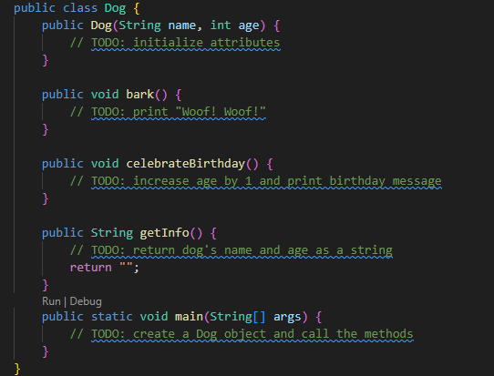

# JavaToPython

This repository contains the assignment for our Programming Languages course. The professor tasked us to convert the Java code found in the image folder into Python.

- Converted Python implementation: [JavaToPython/JavaToPython.py](JavaToPython/JavaToPython.py) (see [`Dog`](JavaToPython/JavaToPython.py) and [`main`](JavaToPython/JavaToPython.py))
- Original Java code (images): 

Run the Python script:

```sh
python JavaToPython.py
```